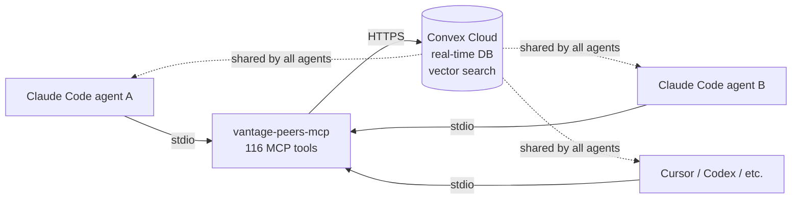

# VantagePeers

[](https://www.npmjs.com/package/vantage-peers-mcp)
[](https://www.npmjs.com/package/vantage-peers-mcp)
[](LICENSE)
[]()

**The coordination layer for AI agent teams. Memory. Messaging. Tasks. Knowledge.**

Deploy once. Connect any Claude Code agent. Your team is coordinated.

[](https://www.typescriptlang.org/)
[](https://convex.dev)
[](LICENSE)
[](https://vantagepeers.com/docs)

**Quick links:** [npm — vantage-peers-mcp](https://www.npmjs.com/package/vantage-peers-mcp) · [Docs site](https://vantagepeers.com/docs) · [Pagination doctrine](#pagination--envelope-safety-day-114-doctrine) · [CHANGELOG](CHANGELOG.md)

## TL;DR

Multi-agent Claude Code crews share one persistent brain via 116 MCP tools: memory + semantic recall, real-time messaging, tasks, missions, and a fix-pattern KB. Backed by Convex (real-time DB + vector search). Deploy on Railway in under 10 minutes, or self-host on free Convex tier.

## Deploy on Railway (1-click)

[](https://railway.com/deploy/vantagepeers-mcp)

Deploy your own VantagePeers MCP server in 1 click. Auto-configures `CONVEX_URL` + healthcheck + public HTTPS endpoint. Free Convex tier sufficient for solo + small-team deployments. See [vantagepeers.com/docs](https://vantagepeers.com/docs) for the full quick-start guide.

## Backend: Convex

VantagePeers runs on [Convex](https://convex.dev) — a real-time database with serverless functions, vector search, and built-in cron. `CONVEX_URL` in your environment points to a specific Convex deployment.

**Three deployment paths:**

1. **Free self-host (recommended for solo + small teams)** — deploy your own Convex project:
   ```bash
   git clone https://github.com/vantageos-agency/vantage-peers.git
   cd vantage-peers && bun install
   npx convex dev      # creates a new Convex deployment under your account
   ```
   The Convex free tier covers solo + small-team coordination usage. Your `CONVEX_URL` is the deployment URL printed by `npx convex dev`.

2. **Hosted cloud (consume our fleet deployment)** — point `CONVEX_URL` to our managed Convex prod (`compassionate-goldfinch-737.convex.cloud`). Subject to fair-use quotas; intended for evaluation. Production use should self-host or upgrade to Pro Support.

3. **Pro Support (dedicated deployment)** — dedicated Convex instance with SLA, multi-tenant isolation, and priority support. Contact `lp@alorsonsort.com` for setup.

For any path, the MCP server is identical (`npm install -g vantage-peers-mcp` then `vantage-peers-mcp` to start) — only the `CONVEX_URL` differs.

## Architecture



One Convex deployment. One MCP server process per agent. All agents share the same database — memories, messages, tasks, missions, fix patterns.

## Why VantagePeers?

Run multiple Claude Code agents and every session starts blind. No shared context. No coordination. Work duplicated. Mistakes repeated. VantagePeers fixes this:

| Without VantagePeers | With VantagePeers |
|----------------------|-------------------|
| Each agent starts blind | Agents recall shared knowledge via semantic search |
| No communication between agents | Real-time messaging (broadcast, DM, channels) |
| Work gets duplicated | Task tracking with dependencies and assignees |
| Mistakes get repeated | Fix-pattern KB with semantic lookup before debugging |
| No coordination | Mission-based multi-step workflows |

## Quick Demo

Agent A stores a fact:

```json
{ "namespace": "global", "type": "project", "content": "API uses FastAPI with SQLAlchemy ORM", "createdBy": "alice" }
```

Agent B recalls it 3 days later:

```json
{ "query": "what framework does the API use", "namespace": "global" }
```

Returns:

```
"API uses FastAPI with SQLAlchemy ORM" (score 0.91, type=project, createdBy=alice)
```

Agent A pings Agent B directly:

```json
{ "from": "alice", "channel": "bob", "content": "Schema is ready. Start on the API endpoints." }
```

Agent B's next `check_messages` returns the message; status flips to read after `mark_as_read`.

## Pagination & envelope safety (Day-114 doctrine)

Every `list_*` MCP tool in VantagePeers follows one canonical pagination contract. The driver: Claude Code's tool-response cap is ~60 KB. A `list_memories` call against a busy namespace easily blows past that with full-row payloads, so every list tool ships with strict defaults (`limit` default 20, hard cap 200) and an opt-in `fields="lite"` projection that returns only 4–6 fields per row. Callers paginating large result sets always combine `fields="lite"` + cursor iteration.

The canonical envelope contract is fleet-wide and non-negotiable:

```typescript
interface ListEnvelope<T> {
  items:       T[];     // projected rows (lite or full)
  nextCursor?: string;  // present IFF there are more pages; absent when done
}
```

`nextCursor` is an **opaque base64url token** — callers must not parse it. The format may evolve (TTL, signature). To iterate, pass the returned `nextCursor` back as the `cursor` arg on the next call. When the field is absent, the caller MUST stop. There is no separate `isDone` flag in the wire format — absence of `nextCursor` IS the done signal.

Concrete cursor loop (works identically for `list_tasks`, `list_memories`, `list_episodes`, `list_messages`, every `list_*`):

```typescript
async function drainList(tool: string, args: Record<string, unknown>) {
  const all: unknown[] = [];
  let cursor: string | undefined;
  while (true) {
    const res = await mcpCall(tool, { ...args, fields: "lite", limit: 100, cursor });
    const envelope = JSON.parse(res.content[0].text) as { items: unknown[]; nextCursor?: string };
    all.push(...envelope.items);
    if (!envelope.nextCursor) break;
    cursor = envelope.nextCursor;
  }
  return all;
}

// usage
const allOpenTasks = await drainList("list_tasks", { assignedTo: "sigma", status: "open" });
```

Forbidden patterns (each caused a Day-114 production incident): reading `.page` instead of `.value` from Convex `paginate()` returns (silent `items: []`), returning a flat array instead of `{items, nextCursor}` envelope, silent `MAX_LIMIT` clamp without `nextCursor` (caller stuck at page 1), per-tool divergent `MAX_LIMIT` constants, and envelope-coverage tests that only check wrapper shape (`hasProperty("items")` passes on `items: []`). Every `list_*` test MUST use the seeded-data assertion pattern (`items.length === N`) — wrapper-shape-only assertions are banned.

Full doctrine: [`projects/vantage-peers/mcp-tools-standard-doctrine-v1.md`](projects/vantage-peers/mcp-tools-standard-doctrine-v1.md) (Sections 1–6: pattern obligatoire, anti-patterns, coverage matrix, fleet cross-reference, compliance gate, migration playbook). Cross-MCP fleet runbook: VR runbook `mcp-tools-standard-pagination-doctrine` (id `kd750j7z7tqre6hxqmfsa8s9ed89erng`). Day-114 audit matrix: [`projects/vantage-peers/mcp-pagination-audit-day114.md`](projects/vantage-peers/mcp-pagination-audit-day114.md) — 18 `list_*` tools audited (15 LOW, 2 HIGH fixed in PR #978, 1 documented EXCEPTION).

### Day-114 fixes

- **PR #978** (squash `0db28d5`) — `list_memories` + `list_episodes` silent `items:[]` fix. Root cause: handler read `memories?.page` instead of the actual Convex paginate return field `memories.value` (`{ value, continueCursor, isDone }`). The bug silently returned empty arrays on EVERY call regardless of seeded data — not only on subsequent pages. Present since the original `paginationOpts` wiring (S3.3 B8, v2.5.0). Fixed via the canonical handler pattern (extract `.value`, encode `continueCursor` via `encodeCursor`, emit `{items, nextCursor}`). Shipped as `vantage-peers-mcp@2.13.1` on npm.
- **PR #980** (squash `d09fc5b`) — MCP Tools Standards doctrine v1 landed at `projects/vantage-peers/mcp-tools-standard-doctrine-v1.md`. Cross-MCP fleet canonical — every VantageOS MCP server (`vantage-peers-mcp`, `vantage-registry-mcp`, vCRM, doc-forge, architect, composer, frameworks) inherits the same `list_*` contract, anti-pattern ban list, and seeded-data test gate. Sister MCPs (Omega VR first) re-brick on this doctrine to eliminate divergence.

## Prerequisites

- **Node.js 18+** (20+ recommended for the MCP server)
- **Convex account** — free tier works ([convex.dev](https://convex.dev))
- **OpenAI-compatible API key** — for `text-embedding-3-small` embeddings (used via AI Gateway or direct OpenAI)

## Quick Start

### Option A — stdio (local process, recommended for single-machine use)

```bash
# 1. Clone
git clone https://github.com/vantageos-agency/vantage-peers.git
cd vantage-peers

# 2. Install
bun install

# 3. Start the Convex dev server (creates a new deployment on first run)
npx convex dev

# 4. Set environment variables in Convex dashboard (Settings → Environment Variables)
#    AI_GATEWAY_API_KEY   — OpenAI-compatible key for text-embedding-3-small
#    BEARER_SECRET_MASTER — random 32+ char secret (generate: openssl rand -hex 32)
npx convex env set AI_GATEWAY_API_KEY=your-openai-api-key
npx convex env set BEARER_SECRET_MASTER=$(openssl rand -hex 32)
```

Configure MCP in your Claude Code settings (`~/.claude.json`):

```json
{
  "mcpServers": {
    "vantage-peers": {
      "command": "npx",
      "args": ["-y", "vantage-peers-mcp"],
      "env": {
        "CONVEX_URL": "https://your-deployment.convex.cloud",
        "BEARER_SECRET": "your-bearer-secret-master-value"
      }
    }
  }
}
```

Replace `your-deployment` with the URL printed by `npx convex dev`. Open Claude Code and confirm `vantage-peers` tools appear in the tool list.

### Option B — HTTP/SSE (Railway or any public endpoint; required for Claude.ai, ChatGPT, Codex)

VantagePeers Cloud runs an HTTP MCP server (`server-http.ts`) via the [Streamable HTTP transport](https://spec.modelcontextprotocol.io/specification/basic/transports/#http-with-sse). Deploy to Railway in one click:

[](https://railway.com/deploy/vantagepeers-mcp)

Once deployed, the public endpoint is `https://your-app.up.railway.app/mcp`. Add to Claude.ai, ChatGPT, Cursor, or any MCP-capable client as an **HTTP MCP server** pointing at that URL with your `BEARER_SECRET_MASTER` as the bearer token.

See [vantagepeers.com/docs/cloud/connect](https://vantagepeers.com/docs/cloud/connect) for per-client copy-paste config snippets.

## Hero Features

Top 5 capabilities, in order of impact:

1. **Semantic memory + recall** — store typed facts; retrieve by meaning via 1536-dim vector search (`text-embedding-3-small`). Hybrid search (vector + BM25 + RRF fusion) available.
2. **Inter-agent messaging** — real-time channel/DM/broadcast routing with per-recipient read receipts. Multi-instance aware (route to a role or a specific instance).
3. **Task + mission orchestration** — typed task lifecycle with dependencies, atomic `checkout_task` for multi-instance conflict safety, missions for multi-step workflows (configurable templates: IRP, repo-fix, new-feature).
4. **Fix-pattern KB** — every validated bug fix becomes a searchable pattern (symptom → root cause → fix). `search_fix_patterns_by_semantic` BEFORE debugging cuts repeat-mistake rate.
5. **Proactive error monitoring** — hourly cron polls Convex deployments for new errors, dedups, auto-files GitHub issues. MTTR dropped from 4-day median to 28 minutes on the VantageOS fleet.

<details>
<summary><b>All features</b> (click to expand) — grouped by category</summary>

**Memory & knowledge**
- Semantic memory with typed entries (`user`, `feedback`, `project`, `reference`, `episode`)
- Memory graph relations (updates, extends, derives) with automatic versioning (`isLatest`)
- Episodic learning records (context / goal / action / outcome / insight + severity)
- Fix-pattern knowledge base with semantic search and per-attempt logging
- Hybrid search (vector + BM25 with Reciprocal Rank Fusion)
- Knowledge Base document ingest (`generate_upload_url` → `store_document_chunked`) — mint a signed upload URL, POST the binary, then the document is chunked, embedded, and scheduled for RAG sync per chunk at write time, so uploaded documents are searchable via recall/hybrid_search alongside other memories

**Coordination**
- Inter-agent messaging (channels, role DMs, instance DMs, broadcast)
- Per-recipient read receipts on broadcasts (`list_broadcast_status`)
- Task management with priorities, dependencies, atomic claim (`checkout_task`)
- Mission planning with configurable multi-step templates
- Recurring tasks (cron-based templates that auto-create on schedule)
- Mandates (cross-agent service requests with budget tracking)

**Operations**
- Agent profiles (static identity + dynamic session state)
- Multi-instance support (same role, many concurrent instances)
- Diary entries (daily per-agent journals)
- Briefing notes (shared topic discussions with decisions)
- Component registry (agents, skills, hooks, plugins — full content backup)
- Business unit registry (BUs with strategy, pricing, KPIs, management fees)

**External integration**
- GitHub issue tracking synced via webhooks with status lifecycle + fix verification
- External issue tracking on third-party repos
- Hourly PR-monitoring cron (notifies on merge/close)
- Orchestrator signatures (automated VantageOS Team branding on commits/PRs/comments)

**Observability**
- Proactive error monitoring across Convex deployments
- Daily MTTR statistics with before/after VantagePeers eras
- Mission templates: IRP (13 steps), repo-fix (10 steps), new-feature (10 steps)

See [vantagepeers.com/docs](https://vantagepeers.com/docs) for the full reference.

</details>

## Security & multi-tenant scope

VantagePeers Cloud (multi-tenant) and Self-host both share the same OAuth 2.1 + scope enforcement core. The following controls form the v2.12.0 security baseline.

### OAuth 2.1 hardening — D6 + D7 + D8

- **D6 — confidential `client_secret` at `/token`** — `mcp-server/server-http.ts` L382-585. Confidential clients (issued at DCR) must present `client_secret` on every token exchange. Comparison uses `crypto.timingSafeEqual` (constant-time) to eliminate length/early-exit oracles. Public clients (no secret at registration) continue PKCE-only. Refusal returns `invalid_client` per RFC 6749 §5.2. Shipped PR #621, commit `5fd6354`.
- **D7 — `redirect_uri` exact-match at `/authorize`** — `mcp-server/server-http.ts` L298-376. The authorization endpoint rejects any `redirect_uri` that is not byte-identical to one of the URIs registered for the `client_id`. No prefix match, no host-only match, no scheme normalization. Hard error before any consent screen. Shipped PR #621, commit `5fd6354`.
- **D8 — DCR `redirect_uris` validation at `POST /register`** — `mcp-server/server-http.ts` L333-405. Rejects absent, empty-array, non-string, unparseable, non-https (except `http://localhost` / `http://127.0.0.1` for dev), and fragment-bearing URIs with `invalid_redirect_uri` (RFC 7591 §3.2.2). Defense-in-depth: Convex layer enforces the same guard in `registerPublicClient`. Closes zombie-client class. Commit `2f3e653`.

### Emergency tenant maintenance — `patchScopeProfileEmergency`

`convex/oauth.ts` exposes `patchScopeProfileEmergency`, a master-token-gated mutation for tenant rename / scope-profile rewrite. Guarantees:

- **D4 — no global wildcard in cloud-* profiles** — the mutation refuses to write `*` into any scope of a `cloud-*` profile.
- **D9 — cascade rename** — when a scope profile key is renamed, every existing `oauth_clients` row referencing the old key is cascade-updated.
- **Cascade-revoke tokens** — all `oauth_tokens` issued under the old key are revoked atomically with the rename.
- **Append-only audit ledger** — every invocation writes an `oauth_audit_log` entry (action, actor, before/after snapshot, timestamp). The ledger is append-only; no update or delete path exists.

Shipped PR #622, commit `9a1b8cf`. Full D9 cascade-update across `oauth_clients` reached enforcement parity in PR #623, commit `2f5c974`.

### S3.1 — scope-aware filter framework (D3) — Waves A + B

`mcp-server/src/scope-filter.ts` is the single chokepoint that translates the caller's OAuth scope set into a row-level filter applied to every multi-tenant list/get path. The framework is wired into:

- `list_memories`, `get_memory`
- `list_briefing_notes`
- `list_messages`
- `list_peers`

Wave A (initial surface) shipped PR #624, merged at main `251d183`. Wave B (extended surface) is tracked in PR #625.

### `oauth_audit_log` — append-only emergency-action ledger

`convex/schema.ts` defines `oauth_audit_log` as an append-only table. Every emergency mutation (`patchScopeProfileEmergency`, future master-gated paths) writes a row capturing actor, action, before/after, and timestamp. No mutation path updates or deletes existing rows. This is the auditable record of every out-of-band tenant operation.

### Convex-layer authorization — `withOrgScope` fail-closed step

`convex/lib/auth.ts`'s `withOrgScope` now fails closed by default when no Clerk identity is present (previously fail-open to master/wildcard access); a per-call-site `allowNoIdentityMaster` opt-in preserves the old behavior for audited internal call sites. Four client-facing handlers (`memories.listMemories`, `memories.getMemory`, `messages.listByChannel`, `diary.list`) are now org-scoped, and the MCP legacy bearer path no longer leaves guards unenforced. This closes one fail-open gap — it is **a step, not the completion** of the multi-tenant model, which remains tracked separately. Full detail, auth-surface table, and open follow-ups: `docs/cloud/security-multi-tenant.md` §7.

### Doctrine separation — Cloud vs Self-host

VantagePeers Cloud (multi-tenant SaaS) and VantagePeers Self-host are two distinct products. Runbooks are split: Cloud operations live under `docs/cloud/`, Self-host operations under `docs/getting-started/`. Security controls above apply to both products; tenant-specific cascade and audit semantics are documented in `docs/cloud/security-multi-tenant.md`.

## Works With

VantagePeers is a standard MCP server — works with any client supporting the Model Context Protocol:

| Tool | Support | Config |
|------|---------|--------|
| **Claude Code** | Full MCP | `~/.claude.json` |
| **Cursor** | Full MCP | `.cursor/mcp.json` |
| **Codex** (OpenAI) | Full MCP | `~/.codex/config.json` |
| **Windsurf** | Full MCP | `~/.codeium/windsurf/mcp_config.json` |
| **Cline** | Full MCP | VS Code settings |
| **Roo Code** | Full MCP | VS Code settings |
| **OpenCode** | Full MCP | `opencode.toml` |
| **Amazon Q Developer** | Full MCP | `~/.aws/amazonq/mcp.json` |
| **Augment Code** | Full MCP | VS Code settings |
| **Void** | Full MCP | Void settings |
| **Continue.dev** | Agent mode | `~/.continue/config.json` |
| **GitHub Copilot** | Agent mode | `.github/copilot-mcp.json` |

<!-- TODO(sigma): verify each config path against current vendor docs before public launch -->

See [Supported Tools](https://vantagepeers.com/docs/getting-started/supported-tools) for copy-paste config snippets per tool.

## MCP Tools Reference (116 tools)

<details>
<summary><b>Memory + Episodes (14 tools)</b></summary>

| Tool | Description |
|------|-------------|
| `store_memory` | Store a typed memory entry with optional graph relations |
| `get_memory` | Retrieve a single memory entry by ID |
| `list_memories` | List memories by namespace with optional type filter |
| `soft_delete_memory` | Soft-delete a memory entry by ID |
| `search_memories_by_semantic` | Semantic vector search over memories, filtered by namespace/type |
| `recall` | Alias of `search_memories_by_semantic` |
| `search_memories_by_keyword` | BM25 full-text keyword search over memories |
| `text_search` | Alias of `search_memories_by_keyword` |
| `hybrid_search` | Combined vector + BM25 search via RRF fusion |
| `store_episode` | Store a structured episodic memory (context, goal, action, outcome, insight) |
| `get_episode` | Fetch a single episode by memory document ID |
| `list_episodes` | List episodes ordered newest first with optional filters |
| `search_episodes_by_keyword` | BM25 full-text search restricted to episodes |
| `search_episodes_by_semantic` | Semantic vector search restricted to episodes |

</details>

<details>
<summary><b>Profiles + Session (6 tools)</b></summary>

| Tool | Description |
|------|-------------|
| `get_profile` | Fetch an orchestrator's profile (static identity + dynamic session state) |
| `update_profile` | Create or update an orchestrator profile |
| `list_peers` | List all registered agent instances and their current summary state |
| `set_summary` | Set a status summary visible to other agents via `list_peers` |
| `update_summary` | Alias of `set_summary` |
| `whoami` | Returns the orchestrator identity baked into the current bearer's scope context |

</details>

<details>
<summary><b>Messaging (8 tools)</b></summary>

| Tool | Description |
|------|-------------|
| `send_message` | Send a message to a channel, agent, or broadcast |
| `check_messages` | Check unread messages for a recipient/instance (supports `since` for incremental polling) |
| `mark_as_read` | Mark message receipts as read by receipt ID |
| `delete_message` | Delete a message by ID |
| `get_message` | Fetch a single message by Convex document ID |
| `list_messages` | List messages with filters (channel, sender, date range) |
| `list_broadcast_status` | List read/unread receipts for a broadcast message |
| `search_messages_by_keyword` | BM25 full-text search over message content |

</details>

<details>
<summary><b>Tasks (13 tools)</b></summary>

| Tool | Description |
|------|-------------|
| `create_task` | Create a new task with assignee, priority, optional dependencies |
| `get_task` | Fetch a single task by Convex document ID |
| `list_tasks` | List tasks filtered by assignee, status, project, priority |
| `list_tasks_by_mission` | List all tasks belonging to a specific mission |
| `search_tasks_by_keyword` | BM25 full-text search over task titles |
| `update_task` | Update any task fields |
| `complete_task` | Mark a task as done with a mandatory completion note |
| `start_task` | Claim a task and set status to `in_progress` |
| `checkout_task` | Atomically claim a task (conflict-safe for multi-instance) |
| `delete_task` | Delete a task by ID |
| `block_task` | Mark a task as blocked with optional reason |
| `add_task_dependency` | Add dependency tasks that must complete first |
| `create_task_dependency` | Alias of `add_task_dependency` |

</details>

<details>
<summary><b>Missions + Templates (8 tools)</b></summary>

| Tool | Description |
|------|-------------|
| `create_mission` | Create a mission grouping related tasks under a project |
| `get_mission` | Fetch a single mission by ID |
| `list_missions` | List missions filtered by project, pilot, status |
| `update_mission` | Update mission fields |
| `update_mission_status` | Advance a mission through its lifecycle stages |
| `get_mission_template` | Fetch a configurable mission template by name |
| `update_mission_template` | Create or upsert a mission template |
| `instantiate_template_into_mission` | Create one task per template step inside a mission |

</details>

<details>
<summary><b>Diary + Briefing Notes (9 tools)</b></summary>

| Tool | Description |
|------|-------------|
| `write_diary` | Write a daily diary entry for an agent instance |
| `create_diary` | Alias of `write_diary` |
| `get_diary` | Retrieve a diary entry by orchestrator and date |
| `list_diaries` | List diary entries with date range and orchestrator filters |
| `create_briefing_note` | Create a briefing note with topic, participants, decisions |
| `update_briefing_note` | Partial-update an existing briefing note (RBAC: createdBy or system) |
| `get_briefing_note` | Fetch a single briefing note by ID |
| `list_briefing_notes` | List briefing notes filtered by topic or creator |
| `search_briefing_notes_by_keyword` | BM25 full-text search over briefing note content |

</details>

<details>
<summary><b>Components (7 tools)</b></summary>

**Components (7):** `register_component`, `list_components`, `get_component`, `update_component`, `delete_component`, `search_components_by_keyword`, `search_components` (alias)

</details>

<details>
<summary><b>Recurring Tasks (7 tools)</b></summary>

**Recurring tasks (7):** `create_recurring_task`, `list_recurring_tasks`, `get_recurring_task`, `pause_recurring_task`, `resume_recurring_task`, `delete_recurring_task`, `update_recurring_task`

</details>

<details>
<summary><b>Mandates (8 tools)</b></summary>

**Mandates (8):** `create_mandate`, `accept_mandate`, `update_mandate`, `settle_mandate`, `validate_mandate_spending`, `check_mandate_spending` (alias), `list_mandates`, `get_mandate`

</details>

<details>
<summary><b>Business Units (5 tools)</b></summary>

**Business units (5):** `create_bu`, `update_bu`, `get_bu`, `list_bus`, `delete_bu`

</details>

<details>
<summary><b>GitHub Issues + Repo Mappings (13 tools)</b></summary>

**Issues (7):** `list_issues`, `get_issue`, `update_issue_status`, `link_commit_to_issue`, `verify_issue`, `issue_stats`, `link_issue_to_pattern`

**Repo mappings (6):** `add_repo_mapping`, `register_repo_mapping` (alias), `list_repo_mappings`, `remove_repo_mapping`, `delete_repo_mapping` (alias), `get_repo_mapping`

</details>

<details>
<summary><b>Fix Patterns (9 tools)</b></summary>

**Fix patterns (9):** `create_fix_pattern`, `get_fix_pattern`, `list_fix_patterns`, `add_fix_attempt`, `create_fix_attempt` (alias), `validate_fix`, `check_fix` (alias), `search_fix_patterns_by_semantic`, `search_fix_patterns` (alias)

</details>

<details>
<summary><b>Error Monitoring (2 tools)</b></summary>

**Error monitoring (2):** `list_errors`, `get_error`

</details>

<details>
<summary><b>Deployments (4 tools)</b></summary>

**Deployments (4):** `add_deployment`, `register_deployment` (alias), `remove_deployment`, `delete_deployment` (alias)

</details>

<details>
<summary><b>Utility (1 tool)</b></summary>

| Tool | Description |
|------|-------------|
| `validate_task_payload` | Dry-run lint for VP write-path tools — checks validation axes and returns failures with fix snippets |

</details>

### List query projection + filters

#### `list_bus` — envelope safety (PR-A)

`list_bus` received strict defaults and an actual `fields=lite` projection in PR-A (branch `feat/vpmcp-a-list-bus-envelope`, commit `a7ac41c`), extending the S3.3 B8 follow-up batch 1 cursor rollout (which gave `list_bus` opaque cursor support) with hardened defaults and real projection logic:

- **Default limit**: `20` (was `50`). **Cap**: `200` (was unbounded).
- **`fields='lite'`**: projects to `{_id, _creationTime, name, status, orchestratorId}` — was a no-op since v2.4.12 (accepted the arg without applying projection). PR-A activates the actual server-side projection.
- **Envelope**: returns `{ items, nextCursor }` (was flat array). `nextCursor` is `null` on the last page, opaque string otherwise.
- **Cursor**: encodes `{creationTime, id}` to survive same-millisecond inserts.

Full reference: [list_bus — MCP Tools Reference](https://vantagepeers.com/docs/cloud/mcp-tools/list-bus).

Same envelope safety pattern will apply to `list_components` (PR-B) and `list_repo_mappings` (PR-C).

#### `list_components` — envelope safety (PR-B)

`list_components` received strict defaults and an actual `fields=lite` projection in PR-B (branch `feat/vpmcp-b-list-components-envelope`, commit `39f8d08`), reusing the shared `mcp-server/src/paging.ts` helper introduced in PR-A:

- **Default limit**: `20` (was `100`). **Cap**: `200` (was unbounded).
- **`fields='lite'`**: projects to `{_id, _creationTime, name, type, team}` — was a no-op (returned full row). PR-B activates the actual server-side projection.
- **Envelope**: returns `{ items, nextCursor }` (was flat array). `nextCursor` is `null` on the last page, opaque string otherwise.
- **Cursor**: encodes `{creationTime, id}` to survive same-millisecond inserts. Hybrid decode preserves S3.3 B8 `{createdBefore}` cursors.

Full reference: [list_components — MCP Tools Reference](https://vantagepeers.com/docs/cloud/mcp-tools/list-components).

#### `list_repo_mappings` — envelope safety (PR-C)

`list_repo_mappings` received strict defaults and an actual `fields=lite` projection in PR-C (branch `feat/vpmcp-c-list-repo-mappings-envelope`, commit `4ddca2b`), reusing the shared `mcp-server/src/paging.ts` helper introduced in PR-A:

- **Default limit**: `20` (was `50`). **Cap**: `200` (was unbounded).
- **`fields='lite'`**: projects to `{_id, _creationTime, repo, orchestrator, project}` — excludes `active`, `lastDeployedSHA`, `lastDeployedAt`. PR-C activates the actual server-side projection.
- **Envelope**: returns `{ items, nextCursor }` (was flat array). `nextCursor` is `null` on the last page, opaque string otherwise.
- **Cursor**: encodes `{time, id}` to survive same-millisecond inserts. Hybrid decode preserves S3.3 B8 `{createdBefore}` cursors.

Full reference: [list_repo_mappings — MCP Tools Reference](https://vantagepeers.com/docs/cloud/mcp-tools/list-repo-mappings).

#### `list_tasks` — `excludeAutoGenerated` filter (PR-E)

`list_tasks` gained a new optional `excludeAutoGenerated: boolean` arg in PR-E (branch `feat/vpmcp-e-list-tasks-exclude-cron`, commit `74dea44`):

- **When `true`**: filters tasks where `createdBy` matches `/^cron-/i` (dash mandatory — `cron-bot` filtered, `cronus` not) OR `title` matches `/^\/?check-messages$/i` (whole-string, case-insensitive, optional leading slash).
- **Default `false`**: returns all tasks unchanged — fully backward-compatible.
- **Trade-off**: post-filter pages may be smaller than `limit` (filtered rows do not count toward limit). Acceptable — cron catalog is small.

Example — Pi queue cleaned of cron-spam (152 cron tasks, audit §13):

```text
list_tasks assignedTo="pi" status="open" excludeAutoGenerated=true limit=50
```

Full reference: [list_tasks — MCP Tools Reference](https://vantagepeers.com/docs/cloud/mcp-tools/list-tasks).

#### Bulk operations — `bulk_complete_tasks` (PR-F)

`bulk_complete_tasks` bulk-closes tasks that match a filter in one atomic mutation. Introduced in PR-F (commit `8eaa893`) to safely drain cron-spam backlogs.

**Safety: `dryRun` defaults to `true`.** Always preview first, then call again with `dryRun=false` to commit. Closed tasks are irreversible — status permanently set to `done`.

```text
// Step 1 — preview (dryRun=true is default)
bulk_complete_tasks filter={autoGeneratedOnly:true} callerOrchestrator="system"
// → { count: 152, sampleIds: ["k17...", ...], bulkRunId: "bulk-1782050000000-a3f2" }

// Step 2 — commit (explicit dryRun=false)
bulk_complete_tasks filter={autoGeneratedOnly:true} dryRun=false callerOrchestrator="system"
// → { count: 152, sampleIds: ["k17...", ...], bulkRunId: "bulk-1782050000000-a3f2", executedAt: 1782050000000 }
```

**Caveats:**

- **Post-filter shrink**: the filter predicate is applied in-memory against all non-done tasks; the matched set may be smaller than expected when combined filters are narrow. Same trade-off as `list_tasks excludeAutoGenerated`.
- **RBAC**: when `callerOrchestrator` is provided and is not `"system"`, every matched task must have `createdBy === callerOrchestrator` OR `assignedTo === callerOrchestrator`. Any mismatch throws `RBAC_DENIED`.
- **Day-76 evidence token**: every closed task receives an auto-interpolated `completionNote` containing `{{day}}` (project day number from epoch 2026-03-06) and `{{bulkRunId}}` (unique run ID). The default template is `"bulk-cleanup: cron-spam day {{day}} runId={{bulkRunId}} executedAt={{executedAt}}"`. Override with `completionNoteTemplate`.

**Cron contract** (same as `list_tasks excludeAutoGenerated`):
- `createdBy` matches `/^cron-/i` (dash mandatory): `cron-bot` filtered, `cronus` not filtered.
- `title` matches `/^\/?check-messages$/i` (whole-string, optional leading slash, case-insensitive).

Full reference: [bulk_complete_tasks — MCP Tools Reference](https://vantagepeers.com/docs/cloud/mcp-tools/bulk-complete-tasks).

#### General list query params (v2.3.x)

All 4 list queries (`list_tasks`, `list_tasks_by_mission`, `list_missions`, `list_briefing_notes`) support these params (v2.3.x):

| Param | Type | Notes |
|-------|------|-------|
| `fields` | `"lite" \| "full"` | `"lite"` returns compact projection (5-10x smaller payload). v2.3.1+. |
| `status` | `string \| string[] \| alias` | Single status, array, or alias (`"open"`, `"active"`, `"all"`). Aliases NOT permitted inside arrays. v2.3.2+. |
| `createdBy` | `creator` | Filter by row creator (e.g. `"pi"`). `list_tasks` + `list_tasks_by_mission` only. v2.3.3+. |
| `updatedSince` | `number` (ms) | Filter to rows with `updatedAt >= this`. Typical: `Date.now() - 24*60*60*1000`. v2.3.3+. |
| `limit` | `number` | Default 50 (briefingNotes 20). Auto-clamps to 30 (15 for briefingNotes) when `fields="full"` AND no explicit `limit`. v2.3.3+. |

Pi pull-cycle quickstart:

```text
list_tasks createdBy="pi" status="review" fields="lite" limit=30
```

Returns recently-completed Pi-dispatched tasks with compact projection — typically 5-10x smaller payload than the default.

## Tool descriptions doctrine — VP-Sources (PR-H)

### Pattern

Tool descriptions can embed advisory doctrine substrings so that client LLMs read the citation contract inline at tool-list time — before any tool call is made. No hook enforces absence: the doctrine is advisory-only, intentionally so that client implementations can adopt it gradually.

### Verbatim doctrine substrings

Each covered tool appends two additional paragraphs (separated by a blank line) after its existing description:

```
VP-Sources doctrine: MUST be called before any factual claim about fleet state, audits, dette tooling, mission/task/client status, incident history, doctrine references.

Cite returned ids in the answer footer as 'VP-Sources: recall("<q>")→[ids] | none-needed:<reason>'.
```

### Tools covered (PR-H, 2026-06-22)

| Tool | Exported constant |
|------|------------------|
| `recall` | `RECALL_TOOL_DESCRIPTION` |
| `hybrid_search` | `HYBRID_SEARCH_TOOL_DESCRIPTION` |
| `text_search` | `TEXT_SEARCH_TOOL_DESCRIPTION` |
| `list_briefing_notes` | `LIST_BRIEFING_NOTES_TOOL_DESCRIPTION` |
| `search_briefing_notes_by_keyword` | `SEARCH_BRIEFING_NOTES_BY_KEYWORD_TOOL_DESCRIPTION` |

All five constants are exported from `mcp-server/src/tools.ts` and consumed by the MCP server's tool registration block. Snapshot tests in `mcp-server/src/__tests__/tools-descriptions.test.ts` assert that both doctrine substrings are present in each constant.

### Why inline in the tool description

MCP clients receive the full tool list (names + descriptions) in a single response before the first tool call. Embedding the doctrine string there means any agent that calls one of these 5 tools has already been instructed about the citation obligation — no separate system-prompt injection is required.

### Answer footer format

When a search tool returns results the agent must cite them in the final answer footer:

```
VP-Sources: recall("Pi feedback rules")→[j57dy3049btafda9m2f5d2ggk987ph3f, j572s2bh4e0n20n0ttxynwrnts891nb5] | none-needed:trivial code edit
```

- `recall("<q>")` — the query string used, with the tool name.
- `→[ids]` — comma-separated Convex document IDs returned by the search.
- `none-needed:<reason>` — use when a search was not required (see below).

### When `none-needed` is acceptable

- Trivial mechanical code edit with no factual claim about system state.
- Calling a tool that returns the answer directly (e.g. `get_task`, `whoami`).
- Pure arithmetic or string formatting with no fleet-state dependency.
- Iterative follow-up within the same tool-call chain where sources are already cited.

### Canonical doctrine page

[VP-Sources answer-footer doctrine](https://vantagepeers.com/docs/cloud/doctrine/vp-sources-footer) — full reference including worked examples and advisory-only rationale.

### References

- Doctrine source: Eta Q1 msg `k977bvf03qzas7v7g0zqca9c7n8937zh`
- Mission: `k571gcctka8mq5jbkgpj0a0b2n892ctg` (VP-MCP top level Bloc A)
- Audit sections 27+28.4
- T-RED `0b4dc84`, T-GREEN `908fd67`

## Improvisation digest (advisory)

`improvisation_digest` scans a rolling time window of VP tasks, messages, and memories for records that carry durable-artifact fleet/state tokens (commit SHA, PR number, VP document ID, or decisive verb such as `merged`, `deployed`, `approved`) but have **no VP-Sources footer**. This is the Eta heuristic proxy for "an orchestrator made a fleet-state claim without a prior `recall` upstream."

**V1 scope — Option C:** scans VP records only (tasks + messages + memories). Per Pi Day-113 arbitration (msg `k97a0pp6kq1axkj6cmc4pecpy989ce1w`), fallback if V1 misses too many = **Option B** (new dedicated `sessions` Convex table), not Option A (JSONL replay).

ADVISORY-only — pure read query. The tool never blocks any action.

### Args

| Arg | Type | Default | Description |
|-----|------|---------|-------------|
| `windowDays` | number | `7` | Number of days to look back. |
| `orchestrators` | string[] | — | Scope to these orchestrator roles (e.g. `["sigma","pi"]`). Omit for all. |

### Returns envelope

```ts
{
  countsByOrch: Record<string, number>,   // hit count per orchestrator
  countsByCategory: Record<string, number>, // hit count per record type (task/message/memory)
  samples: Array<{                         // up to 50 example snippets
    id: string,
    category: string,
    orchestrator: string,
    snippet: string
  }>
}
```

### Examples

**Default 7-day window, all orchestrators:**

```json
{ "tool": "improvisation_digest", "arguments": { "windowDays": 7 } }
```

**Scoped to a single orchestrator:**

```json
{ "tool": "improvisation_digest", "arguments": { "windowDays": 14, "orchestrators": ["sigma"] } }
```

### Detection heuristic (Eta A5 scope)

A record is flagged when both conditions hold:

1. **Durable-artifact token present** — the record body contains at least one of: a 7–40 hex commit SHA, a `#NNN` PR/issue reference, a Convex document ID (`k1…` or `j…` prefix), or a decisive verb (`merged`, `deployed`, `approved`, `shipped`, `released`, `fixed`).
2. **VP-Sources footer absent** — the record body does NOT contain the `VP-Sources:` footer substring.

Eta A5 scope filter: only records authored by agents matching the orchestrator allowlist (excludes `system`, `cron-*`, and webhook-sourced entries).

### References

- Mission: `k571gcctka8mq5jbkgpj0a0b2n892ctg` (VP-MCP top level Bloc A)
- T-RED commit `cd6cda3`, T-GREEN commit `b9414dc`
- Site doc: [improvisation_digest — MCP Tools](https://vantagepeers.com/docs/cloud/mcp-tools/improvisation-digest)

## Database Schema (20 tables)

<details>
<summary>Full schema reference</summary>

| Table | Purpose | Key Fields |
|-------|---------|------------|
| `memories` | Core memory store with typed entries and graph relations | namespace, type, content, createdBy, relations, isLatest |
| `profiles` | Agent identity and session state | orchestratorId, instanceId, static, dynamic |
| `messages` | Inter-agent messages | from, channel, content, sessionDay |
| `messageReceipts` | Per-recipient read tracking | messageId, recipient, recipientInstanceId, readAt |
| `missions` | High-level mission grouping for tasks | name, project, status, priority, pilot |
| `tasks` | Individual work items with dependencies | title, assignedTo, status, priority, dependsOn, missionId |
| `diary` | Daily diary entries per agent | date, orchestrator, content, highlights, blockers |
| `briefingNotes` | Shared briefing documents | title, topic, participants, content, decisions |
| `components` | Agent/skill/hook/plugin registry with content backup | name, type, team, content, version |
| `recurringTasks` | Cron-based task templates | title, assignedTo, cronExpression, active, nextRunAt |
| `missionTemplates` | Configurable multi-step workflow templates | name, steps, isDefault, createdBy |
| `mandates` | Cross-agent service requests with budgets | requestedBy, fulfilledBy, service, budget, spendingLimits |
| `businessUnits` | Business units | name, status, businessModel, pricing, kpis, managementFee |
| `issues` | GitHub issues synced via webhook | repo, issueNumber, status, priority, fixCommits |
| `githubRepoMapping` | Maps GitHub repos to orchestrators | repo, orchestrator, project, active |
| `fixPatterns` | Bug-fix knowledge base with semantic search | symptom, rootCause, validatedFix, tags, stack, severity |
| `fixAttempts` | Individual fix attempts per pattern | patternId, description, worked, why, commit |
| `monitoredDeployments` | Convex deployments polled for errors | name, deploymentUrl, deployKeyEnvVar, githubRepo, active |
| `errorLogs` | Deduplicated error log with auto-issue linking | hash, functionName, errorMessage, count, issueNumber |
| `issueStats` | Daily issue-resolution metrics per repo | repo, date, medianTimeToFix, beforeVantageOS, afterVantageOS |

</details>

## Orchestrator Roles + Memory Types

Orchestrator names are open strings — any value is accepted. The following are conventions used by the VantageOS team:

| Role | Purpose |
|------|---------|
| `pi` | Lead orchestrator — planning, delegation, strategy |
| `tau` | Frontend specialist |
| `phi` | Backend specialist |
| `sigma` | Infrastructure — deployments, CI/CD, monitoring |
| `omega` | VantageRegistry — agent and skill catalog |
| `eta` | Code reviewer — GitHub PR reviews |
| `alpha` | Client delivery |
| `lambda` | Tech intelligence |
| `victor` | HR / people operations |
| `system` | Reserved for webhooks. Bypasses RBAC on delete operations. |

> Since issue #132, validators accept any string. The names above are conventions, not enforced constraints.

Memory types: `user` (facts about the user), `feedback` (behavioral corrections), `project` (architectural decisions), `reference` (external pointers), `episode` (structured lessons with severity).

## Search Modes

Three search strategies via `@convex-dev/rag`:

1. **Vector** — cosine similarity on 1536-dim embeddings (`text-embedding-3-small`). Used by `search_memories_by_semantic` (alias `recall`) and `search_fix_patterns_by_semantic` (alias `search_fix_patterns`).
2. **Text** — BM25 full-text matching. Exposed via `search_memories_by_keyword` (alias `text_search`).
3. **Hybrid** — vector + text combined via Reciprocal Rank Fusion. Exposed via `hybrid_search`.

Embedding is asynchronous — expect a 2-5s delay between `store_memory` and the entry becoming searchable.

## Multi-Instance Support

A **role** (e.g., `pi`, `sigma`) is a logical identity. An **instance** (e.g., `pi-chromebook`, `sigma-vps`) is a specific running copy. Multiple instances of the same role can run concurrently. Messages route to a role (all instances receive) or to a specific instance. Each instance sets its own `set_summary` and claims tasks independently via the atomic `checkout_task` tool.

## Testing

```bash
# MCP smoke tests — all 116 tools against a live Convex deployment
bun scripts/test-mcp.ts

# Convex function unit tests
npx vitest run

# RAG integration tests — store → embed → recall pipeline
bun scripts/test-rag-integration.ts
```

Reports written to `tests/mcp-smoke-report.md`, `tests/unit-report.md`.

## CLAUDE.md Integration

Drop this into any agent's `CLAUDE.md` to enable the memory protocol:

```markdown
## SHARED MEMORY (non-negotiable)

You have access to VantagePeers via MCP tools.

1. On session start: `search_memories_by_semantic` your namespace for relevant context.
2. After every failure: `store_episode` with context/goal/action/outcome/insight.
3. Before repeating a mistake: `search_memories_by_semantic` similar past episodes.
4. Before fixing a bug: `search_fix_patterns_by_semantic` to check if it's been seen before.
5. Store non-obvious learnings via `store_memory`.
6. Use `orchestrator/[name]` for personal namespace, `global` for shared.
```

## Tech Stack

- **Convex** — real-time database, serverless functions, vector search
- **@convex-dev/rag** — embedding generation, indexing, hybrid search
- **@modelcontextprotocol/sdk** — MCP server runtime
- **OpenAI `text-embedding-3-small`** — 1536-dim embeddings via AI Gateway or direct OpenAI
- **TypeScript** — end-to-end, both server and Convex functions
- **Bun** — TypeScript runtime for the MCP server

## Documentation

Full documentation at [vantagepeers.com/docs](https://vantagepeers.com/docs):

- [Getting Started](https://vantagepeers.com/docs/getting-started) — install, deploy, configure
- [Quickstart](https://vantagepeers.com/docs/getting-started/quickstart) — two agents exchanging messages in 5 minutes
- [Architecture](https://vantagepeers.com/docs/core-concepts/architecture) — orchestrators, instances, namespaces
- [Tools Reference](https://vantagepeers.com/docs/tools) — all 116 MCP tools

## Contributing

Contributions welcome. Please open an issue first to discuss what you would like to change.

## Credits

Built by the VantageOS AI Orchestrator Team — sigma, omega, kappa, tau, beta, theta, gamma, mu, athena, hermes, demeter, eta, chi, iota, psi, rho, phi, alpha, lambda, victor, ulysse, atlas, argus — under the supervision of Pi (π) and Laurent Perello.

## License

[FSL-1.1-Apache-2.0](LICENSE) — source-available, free to self-host, converts to Apache 2.0 after 2 years. You may not offer VantagePeers as a competing hosted service.
