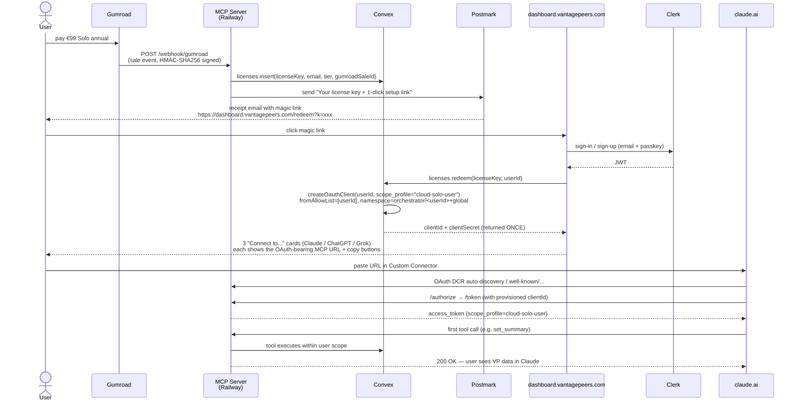
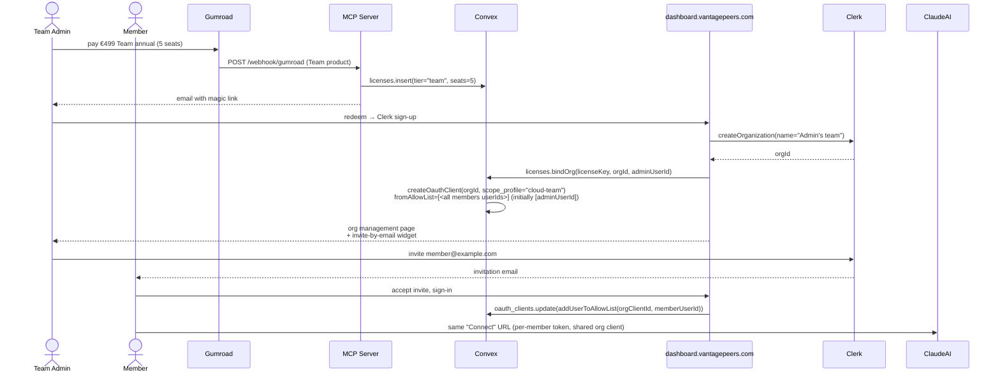
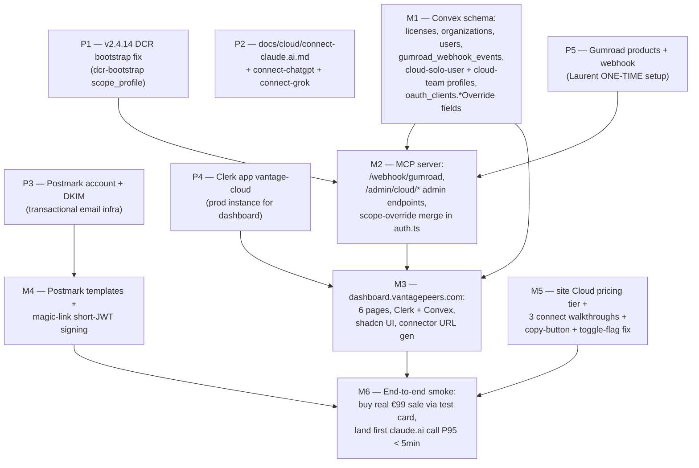

# VantagePeers Cloud — Production Launch Plan

**Date** : 2026-06-03
**Author** : Sigma (σ) — vantage-peers orchestrator
**Status** : DRAFT — pending Pi review
**Supersedes** : (none — first canonical Cloud launch plan)
**Task** : `k170vh10krpa3j35sz7f7ffhy187yv3r` (dispatched by Pi 2026-06-03)
**Scope** : VantagePeers **Cloud** product (multi-tenant). NOT Self-host. Per CLAUDE.md L7 separation.

---

## TL;DR

VantagePeers Cloud Solo + Team launch in 4 milestones, blocked behind two prerequisites (DCR bootstrap fix v2.4.14 + Cloud-connect docs gap).

End-state target user journey for **Solo** :

```
Gumroad checkout → license email (auto, < 30s) → dashboard.vantagepeers.com login (Clerk email/passkey) →
paste license → DCR client + scope_profile provisioned server-side (1 call) →
copy "Add to Claude.ai" URL → paste in claude.ai Custom Connector → OAuth approve → first MCP call works.
```

Median time-to-first-tool-call target : **under 5 minutes from Gumroad receipt**. The DCR client is provisioned **server-side** before the OAuth dance, so the user never sees a 403.

For **Team** : same first 3 steps, then Clerk Organization creation, invite members by email, each member runs the Solo "paste URL" step against a team-scoped OAuth client tied to the org.

---

## A. Architecture

### A.1 Component map

```
                       ┌──────────────────────────────────────────────────┐
                       │                  USER (Solo or Team)             │
                       └──┬──────────────────┬────────────────────────────┘
                          │                  │
                  (1) buy │                  │ (4) connect MCP client
                          ▼                  ▼
                  ┌───────────────┐   ┌────────────────────────────┐
                  │   Gumroad     │   │ claude.ai / ChatGPT / Grok │
                  │ Solo / Team   │   │ Custom Connector           │
                  └──────┬────────┘   └──────────────┬─────────────┘
                         │ (2) webhook ping          │ (5) DCR /authorize
                         ▼                           ▼
        ┌────────────────────────────────────────────────────────────┐
        │  vantage-peers-mcp (Railway HTTPS — PUBLIC_BASE_URL)       │
        │  ┌──────────┐ ┌──────────┐ ┌──────────────┐ ┌───────────┐  │
        │  │/webhook  │ │/dashboard│ │OAuth (/auth, │ │MCP        │  │
        │  │/gumroad  │ │ proxy    │ │/token,       │ │/mcp       │  │
        │  │          │ │          │ │/register)    │ │           │  │
        │  └────┬─────┘ └────┬─────┘ └──────┬───────┘ └─────┬─────┘  │
        └───────┼────────────┼──────────────┼───────────────┼────────┘
                │            │              │               │
                ▼            ▼              ▼               ▼
        ┌────────────────────────────────────────────────────────────┐
        │            Convex backend (compassionate-goldfinch-737)    │
        │  ┌───────────┐ ┌──────────────┐ ┌────────────────────────┐ │
        │  │ licenses  │ │ oauth_clients│ │ oauth_scope_profiles   │ │
        │  │ orgs      │ │ access_tokens│ │ (master / public-/...) │ │
        │  │ users     │ └──────────────┘ └────────────────────────┘ │
        │  └───────────┘                                              │
        │           ▼                                                 │
        │  ┌───────────────────────────────────────────────────────┐  │
        │  │ Existing tables : memories, tasks, messages,          │  │
        │  │ diaries, missions, briefings, episodes, fix-patterns  │  │
        │  └───────────────────────────────────────────────────────┘  │
        └────────────────────────────────────────────────────────────┘
                ▲
                │ Clerk JWT (signed)
        ┌───────┴───────────────────┐
        │ dashboard.vantagepeers.com│
        │ Next.js + Clerk + shadcn  │
        │ — license redeem          │
        │ — org / member mgmt       │
        │ — MCP credentials view    │
        │ — connect-guide deep links│
        └───────────────────────────┘
```

### A.2 Reuse vs build vs modify

| Component | Status | Notes |
|---|---|---|
| **Convex backend** `compassionate-goldfinch-737` | REUSE | already prod for MCP. Add `licenses`, `organizations`, `users` tables + `gumroad_webhook_events` audit table. |
| **MCP server** `vantage-peers-mcp` on Railway | REUSE + MODIFY | add `/webhook/gumroad`, `/admin/cloud/*` endpoints, and the v2.4.14 DCR bootstrap fix (see G). |
| **Clerk** | REUSE (existing Clerk app on perello-consulting / `vantage-cloud` Clerk app — to confirm) | own auth on dashboard. Webhook → Convex for user/org sync (pattern already proven on Iota Day 53). |
| **Dashboard** `dashboard.vantagepeers.com` | **BUILD** | new Next.js 15 App Router + Clerk + shadcn. NOT the kappa `bu-dashboard-two.vercel.app` (that one is fleet-internal — keep separation). 6 pages, scope below. |
| **Gumroad** | EXTERNAL config | Laurent creates 2 products + 1 webhook URL once (Day 53 ONE-TIME human action pattern). |
| **Site** `vantagepeers.com` (Fumadocs) | MODIFY | add Cloud pricing tier in `peers-pricing.tsx`, add `/docs/cloud/connect-claude.ai`, `/docs/cloud/connect-chatgpt`, `/docs/cloud/connect-grok` (3 walkthroughs). |
| **kappa BU dashboard** | NOT TOUCHED | fleet-internal, no exposure to Cloud users. |
| **Mosaic** `@vantageos/mosaic` v0.2.0 | OPTIONAL parallel | dashboard can ship without it v1, adopt v2. |

### A.3 End-to-end flow — Solo



### A.4 End-to-end flow — Team



---

## B. Gumroad integration

### B.1 Products (Laurent creates ONCE)

| Product | Price | Tier | Webhook product_id |
|---|---|---|---|
| **VantagePeers Cloud — Solo** | €99/year | `cloud-solo` | `vp-cloud-solo` |
| **VantagePeers Cloud — Team (5 seats)** | €499/year | `cloud-team-5` | `vp-cloud-team-5` |

Pricing rationale : Self-host stays Free, QuickStart €290 one-time + Pro Support €49/mo stay as service tiers (already on `peers-pricing.tsx`). Cloud Solo at €99/yr sits in Tier 2 Standard per the 4-tier framework (memory `j578hmzrrf4z9djh12gdptw5a185m9k8`) and aligns with Cédric's existing €99/yr Pro Support precedent. Team €499/yr = €99/seat for 5 seats, with overage at €99/seat extra (add-on product later).

Tarifs additionnels possibles v2 (NOT v1) : Team-10 / Team-25 / Enterprise (volume + invoicing). Out of scope for launch.

### B.2 Webhook contract

**Endpoint** : `POST {PUBLIC_BASE_URL}/webhook/gumroad`
**Auth** : Gumroad signs each ping with `X-Gumroad-Signature` (HMAC-SHA256 against the JSON body using the seller's webhook secret). Verify in `mcp-server/src/webhooks/gumroad.ts`.
**Idempotency** : every event has `sale_id` ; we dedup against `gumroad_webhook_events.saleId` (unique index).
**Events handled** :

| Gumroad event | Action |
|---|---|
| `sale` (new purchase) | insert `licenses` row, send magic-link email |
| `refund` | revoke license + revoke all OAuth tokens issued under it |
| `cancellation` (subscription) | mark license `cancelledAt` ; do NOT revoke until period end |
| `subscription_restarted` | clear `cancelledAt` |
| `subscription_updated` | reflect plan change in `licenses.tier` |

### B.3 Annual renewal

Gumroad handles the recurring charge. On `subscription_charged` we update `licenses.activeUntil = now() + 1 year`. On `subscription_failed` we send an email warning then revoke after a grace period (configurable; default 7 days).

### B.4 Refund window

Within Gumroad's standard 60-day refund window, a `refund` webhook immediately revokes all tokens. The dashboard shows the user a `refunded` state with a re-purchase CTA. License key is destroyed (cannot be re-redeemed).

---

## C. License key delivery UX

### C.1 Key format

```
vp_cloud_<tier>_<base32-26-chars>
e.g. vp_cloud_solo_KZJ4P7TQR2N8MFB6XCYA9DWHL5
```

26 base32 chars = 130 bits of entropy (well above the 128-bit threshold). Prefix carries tier for visual sanity-checks and one-shot regex validation client-side.

The key is stored **hashed** server-side (SHA-256). On redemption the user pastes the raw key, Convex hashes it, looks up by hash. Same pattern as OAuth client secrets today.

### C.2 Delivery channels (both fire on `sale` webhook)

1. **Gumroad receipt email** (auto, controlled by Gumroad product config) carries the key in the "Content delivery" field.
2. **Custom Postmark transactional email** from `cloud@vantagepeers.com` carries a **magic link** : `https://dashboard.vantagepeers.com/redeem?k=<key>&t=<short-jwt>`. The short-JWT is a 24-hour single-use token that lets the user land directly on the redeem page with the key pre-filled — no copy-paste step. Postmark gives us deliverability + open-tracking, Gumroad email is the backup.

### C.3 Step-by-step user workflow (Solo)

```
T+0       Pay €99 on Gumroad checkout
T+0:00:10 Gumroad → Convex webhook → license row created
T+0:00:15 Magic-link email sent (Postmark)
T+0:01    User opens email, clicks magic link
T+0:01:05 dashboard.vantagepeers.com auto-redeems, prompts Clerk sign-up (email + passkey)
T+0:02    User completes Clerk sign-up
T+0:02:05 DCR client created server-side, dashboard shows "Connect to Claude.ai" card
T+0:02:30 User clicks copy button, switches to claude.ai
T+0:03    Paste URL into Custom Connector
T+0:03:30 OAuth dance completes (no consent friction — DCR client already provisioned)
T+0:04    First successful set_summary call in claude.ai chat
```

P95 target : 5 minutes. P50 target : 3 minutes.

---

## D. Dashboard UX

### D.1 Domain decision

**`dashboard.vantagepeers.com`** — dedicated subdomain. NOT the kappa fleet dashboard (`bu-dashboard-two.vercel.app`) per the 3-bricks doctrine (memory `j577v87karzy23svmdnmr9my0584jsvf`). kappa stays fleet-internal ; the Cloud dashboard is a public product surface.

Stack : Next.js 15 App Router + Clerk + shadcn/ui + Tailwind 4. Hosted on Vercel. Single Convex client.

### D.2 Pages (v1 launch — 6 pages)

| Route | Purpose |
|---|---|
| `/` | landing + sign-in (Clerk redirect to `/redeem` if no license, `/home` if license active) |
| `/redeem` | paste key OR auto-redeem from magic link |
| `/home` | account dashboard : license tier, expiry, MCP credentials, "Connect to..." cards |
| `/team` (Team only) | org name, member list, invite UI, seat usage |
| `/connect/[client]` | step-by-step connect guide for `claude.ai` / `chatgpt` / `grok` (deep-linked from /home) |
| `/account` | email, password reset (Clerk-hosted), billing portal link (Gumroad customer portal) |

### D.3 Auth chain

```
Browser ─Clerk SDK→ Clerk hosted auth
                       │
                       │ signed JWT (orgId? userId)
                       ▼
                   Next.js server actions
                       │
                       │ Convex JWT (Clerk-issued)
                       ▼
                   Convex queries/mutations
                       │
                       │ scoped by userId / orgId
                       ▼
                   licenses, oauth_clients, ...
```

Dashboard never issues OAuth bearers directly to the user — it tells Convex "provision an oauth_client for me", and renders the resulting connector URL. The bearer flow itself is the standard MCP DCR dance, originated by Claude.ai/ChatGPT/Grok.

### D.4 Connector URL format

What the dashboard hands the user :

```
https://<PUBLIC_BASE_URL>/mcp?client=<clientId>
```

That's enough for claude.ai/ChatGPT/Grok to bootstrap DCR via `.well-known`. The `?client=<clientId>` hint lets the MCP server skip the `/register` step and bind directly to the pre-provisioned client.

This means **the v2.4.14 DCR bootstrap fix is NOT actually needed for the Cloud Solo/Team flow** because the dashboard pre-provisions the client. The fix remains valuable for ad-hoc self-onboarding via the public `/docs/cloud/skills` Onboard skill (covered in G).

---

## E. MCP connect flow — Solo

### E.1 OAuth client lifecycle

- One `oauth_clients` row per redeemed license.
- `scope_profile = "cloud-solo-user"` (new profile, defined below).
- `fromAllowList = [<userId>]` — exact string. The user calls `send_message from="userId-xxx"` and gets through ; any other `from` value returns 403 with the canonical "Allowed: userId-xxx" message (auth.ts:180 already emits this).
- `namespaceReadPrefixes = ["orchestrator/user-<userId>", "project/user-<userId>", "global"]`
- `namespaceWritePrefixes = ["orchestrator/user-<userId>", "project/user-<userId>"]`
- `global` is read-only for Solo (so users can read fix-patterns, public templates, but not pollute global state).

### E.2 New scope profile (one-time seed)

```ts
// convex/oauth.ts seedDefaultProfiles — added entry
{
  profileId: "cloud-solo-user",
  description: "Per-user Cloud Solo. Self-scoped namespaces + read-only global.",
  fromAllowList: [],                 // overridden per-row at client creation
  namespaceReadPrefixes: ["global"], // base read scope
  namespaceWritePrefixes: [],        // base write scope
}
```

The `oauth_clients` row carries the **effective** allow-list (overriding base profile). This requires a small `oauth_clients` schema bump : add `fromAllowListOverride?: string[]` + `namespaceReadOverride?: string[]` + `namespaceWriteOverride?: string[]` fields, and update `auth.ts` to merge profile + overrides on token lookup. Pattern same as v2.5 of Iota's per-user scoping.

### E.3 First call

User calls `set_summary(orchestratorId="user-<userId>", instanceId="user-<userId>-claude")` in claude.ai. Token resolution :

```
Bearer → oauth_access_tokens.lookup → oauth_clients(scope_profile="cloud-solo-user", fromAllowListOverride=["user-<userId>"])
       → checkFromAllowed: "user-<userId>" in override → pass
       → set_summary executes against profiles table, orchestratorId="user-<userId>"
```

200 OK on first try.

---

## F. MCP connect flow — Team

### F.1 Clerk Organization mapping

- `licenses.bindOrg(licenseKey, orgId)` creates the binding.
- One `oauth_clients` row per Clerk org.
- `scope_profile = "cloud-team"` (new).
- `fromAllowListOverride = [<all member userIds>]` — updated on every member add/remove (Clerk webhook → Convex mutation).
- `namespaceRead/WritePrefixes` = `["team/<orgId>", "orchestrator/user-<userId>", "global"]` (Team members get both private space + shared team space).

### F.2 Roles

Clerk org roles `admin` and `member` :
- `admin` can invite + revoke members, rotate the OAuth client secret, view license + billing portal link.
- `member` can connect their MCP client and read/write within `team/<orgId>` + their own `orchestrator/user-<userId>`.

The Cloud dashboard reads `clerk_org_membership` and maps it to UI affordances ; the MCP server enforces scoping at the auth layer (regardless of dashboard).

### F.3 Per-member token vs shared org token

**Choice : per-member tokens, single shared org `oauth_client`.**

Each member runs the Solo flow against the same `clientId` (shown to admin, distributed to members via the dashboard invite). DCR with that `clientId` issues a member-bound token — `oauth_access_tokens.userId` carries the member's userId, so tool calls are attributable per member while sharing scope.

Why this choice : per-member `oauth_clients` would multiply rows × seats and complicate revocation. Shared client + per-member tokens scales to Team-25 / Team-50 in v2 without schema churn.

### F.4 Member leave / revoke

On Clerk `organization.membership.deleted` :
1. Webhook → Convex.
2. Remove `userId` from `oauth_clients.fromAllowListOverride`.
3. Revoke all `oauth_access_tokens` where `userId == leaver`.
Token revocation is immediate ; the MCP server checks `revokedAt` on every request (already implemented).

### F.5 Org admin transfer

Clerk org admin can transfer admin role to another member. License binding stays on `orgId`, not `adminUserId`, so no Convex action is needed.

---

## G. Dependencies graph



**Ship order** :
1. **P1–P5** in parallel (all unblocking).
2. **M1** (Convex schema) blocks M2 + M3.
3. **M2** + **M4** can run in parallel after M1.
4. **M3** blocks on M1 + M2.
5. **M5** parallel to everything.
6. **M6** is the gate before launch announcement.

**Critical path** : P1 → M1 → M2 → M3 → M6.

**Parallel-safe** : M5 (site copy + 3 walkthroughs), M4 (Postmark setup), P3 (DKIM propagation up to 24h).

---

## H. Effort (S / M / L per RULE #3 no-timelines)

| Item | Effort | Notes |
|---|---|---|
| P1 — DCR bootstrap fix v2.4.14 | **S** | scope_profile addition + DEFAULT constant flip + 1 hook update |
| P2 — 3 connect walkthroughs | **S** | content writing, no code |
| P3 — Postmark account + DKIM | **S** | one-time human setup, then waits for DNS propagation |
| P4 — Clerk vantage-cloud app | **S** | one-time human setup, copy keys to Convex env |
| P5 — Gumroad products + webhook | **S** | Laurent fills 2 product forms + 1 webhook URL field |
| M1 — Convex schema + profiles | **M** | 4 new tables, 2 new profiles, override fields on oauth_clients, migration of existing oauth profile reads |
| M2 — MCP server endpoints | **M** | webhook handler (HMAC verify + 5 event types), admin endpoints, scope-override merge |
| M3 — Dashboard (Next.js + Clerk + 6 pages) | **L** | full new app, Clerk + Convex wired, connector URL generator, copy buttons |
| M4 — Postmark + magic-link signing | **S** | 1 template + 1 short-JWT signer + Convex action |
| M5 — Site pricing + walkthroughs + UX fixes | **M** | new Cloud tier card, 3 walkthroughs (claude.ai / chatgpt / grok), copy buttons in inline values, ChatGPT toggle step |
| M6 — E2E smoke (real Gumroad sale) | **S** | one buy with test card, observe full pipeline, log P50/P95 |

Rough portfolio sizing : 6× S + 3× M + 1× L. M3 is the single biggest cost (new dashboard app).

---

## I. Risks + mitigations

| # | Risk | Mitigation |
|---|---|---|
| R1 | Gumroad webhook missed → user paid but no license | Idempotent retry queue. `gumroad_webhook_events` table tracks every ping. Admin endpoint `POST /admin/cloud/resync-sales?since=<ts>` re-fetches via Gumroad API and replays missed sales. Dashboard "I paid but didn't get a key" form pings same endpoint with sale_id. |
| R2 | License key compromised (forwarded by user) | Single-use redemption (`licenses.redeemedAt` set on first use, rejected after). To re-deploy, user can rotate via dashboard ; admin can rotate via `/admin/cloud/rotate-license`. |
| R3 | Refund mid-year (after Gumroad 60-day window) | Manual admin action via `/admin/cloud/revoke-license`. Out-of-window refunds require Laurent's signal — no automatic policy. |
| R4 | Team member leaves abruptly | Clerk webhook revokes membership ; Convex revokes member's tokens immediately ; team write-access removed within 1 request RTT. |
| R5 | Team admin departs (transfers ownership) | Clerk org admin transfer is supported. License binding stays on orgId, so no data move needed. Dashboard prompts new admin to confirm billing access. |
| R6 | Fraud (chargeback after Gumroad clears) | Gumroad takes the loss. We revoke on `dispute_won_by_buyer` event. Monitor `licenses.fraudFlag` in dashboard. |
| R7 | DCR onboarding skill 403 (Day 90 bug surface) | v2.4.14 P1 fix ships before launch. Until then, dashboard pre-provisions client (Cloud users never hit the bug). Self-onboarding skill via `/docs/cloud/skills` stays gated behind P1. |
| R8 | Postmark deliverability dip (spam folder) | Gumroad receipt email is the fallback — it always carries the key. Magic link is nice-to-have ; the key alone is sufficient. |
| R9 | Convex prod schema migration breaks existing oauth_clients reads | Schema additions are non-breaking (new optional fields, new tables). Migration is a no-op deploy. Backfill is implicit (override fields default to `undefined` = fall back to profile). |
| R10 | Mosaic v0.2.0 lands mid-build and dashboard wants to consume | Dashboard ships with shadcn alone v1. Mosaic adoption is a v2 follow-up — does not block launch. |

---

## Decisions captured (each is reversible but defaults stand)

| ID | Decision | Rationale |
|---|---|---|
| D1 | Dashboard = **new app on `dashboard.vantagepeers.com`** | 3-bricks doctrine ; kappa stays fleet-internal |
| D2 | Pricing : **Solo €99/yr, Team-5 €499/yr** | Tier 2 Standard framework + Cédric €99/yr precedent + €99/seat parity |
| D3 | License format = **`vp_cloud_<tier>_<base32-26>`** | 130 bits entropy + visual tier sanity check |
| D4 | OAuth client = **server-pre-provisioned, NOT user-DCR** | sidesteps the Day 90 fromAllowList=[] bug for paying users entirely |
| D5 | Team model = **one `oauth_client` per org + per-member tokens** | scales to Team-25/50 without schema churn |
| D6 | `global` namespace = **read-only for Solo + Team** | prevents end-user pollution of fleet-shared knowledge |
| D7 | Email infra = **Postmark transactional + Gumroad receipt fallback** | redundancy on the most user-visible step |
| D8 | Mosaic adoption = **v2 dashboard follow-up, not launch blocker** | launch ships with shadcn alone |

---

## Open questions for Pi review

1. **Pricing** : confirm €99 Solo / €499 Team-5 — Laurent may want a different anchor based on competitor pricing research not surfaced in recall.
2. **Clerk app** : reuse an existing prod Clerk app (which one ?) or create dedicated `vantage-cloud` ? Default = dedicated, isolates billing.
3. **Domain** : `dashboard.vantagepeers.com` vs `app.vantagepeers.com` vs `cloud.vantagepeers.com` — naming choice.
4. **Refund policy** : 60-day Gumroad default acceptable, or do we offer 14-day "no questions" custom policy ?
5. **Team-5 overage** : sell additional seats à la carte (€99/seat add-on) v1, or push users to Team-10 product v1 ? Default = à la carte.
6. **Free trial** : 7-day trial on Solo v1, or paid-only ? Default = paid-only (simpler, matches QuickStart pattern).
7. **Skill Onboard at `/docs/cloud/skills`** : keep it (with v2.4.14 fix) or sunset in favor of dashboard-only flow ? Default = keep, it serves curious devs who haven't paid yet.

---

## Refs

- Task : `k170vh10krpa3j35sz7f7ffhy187yv3r`
- Pi dispatch message : `jn79mbvkmqefffp0g2pwq38hgn87zzzx`
- DCR bug analysis : Pi message `jn76vxwdeeym16hhmvn0rnzxxd87ze9w` + Sigma reply `jn7dtyxfa62wjkmtrm9f6p5yc987z0qy`
- Site UX gaps (toggle + copy buttons) : Pi message `jn763d4nptx86f24rdvsrjynmn87ytmq`
- 2-products separation doctrine : memory `j57dy3049btafda9m2f5d2ggk987ph3f` + CLAUDE.md L5-13
- 3-bricks architecture : memory `j577v87karzy23svmdnmr9my0584jsvf`
- 4-tier pricing framework : memory `j578hmzrrf4z9djh12gdptw5a185m9k8`
- ONE-TIME human-action doctrine : memory `j570dtbs77g7tk9c0j3mh6awtd85q75s`
- Mosaic v2 brief : memory `j579e74vxv566a10readet4zch87xxv9`
- Convex prod deployment : memory `j579xztjdent20v8zvwm59tvwx84vbvd`
- DCR endpoint code : `mcp-server/server-http.ts` L75 (`DEFAULT_PUBLIC_DCR_PROFILE`), L159-185 (.well-known), L216 (`/register`)
- Scope enforcement code : `mcp-server/src/auth.ts` L155-181 (`checkFromAllowed` + `isMasterScope`)
- Default scope profiles : `convex/oauth.ts` L83-153 (`seedDefaultProfiles`)

---

*End — Sigma — vantage-peers — 2026-06-03*
